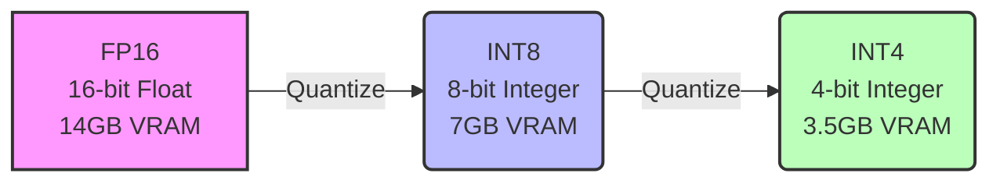
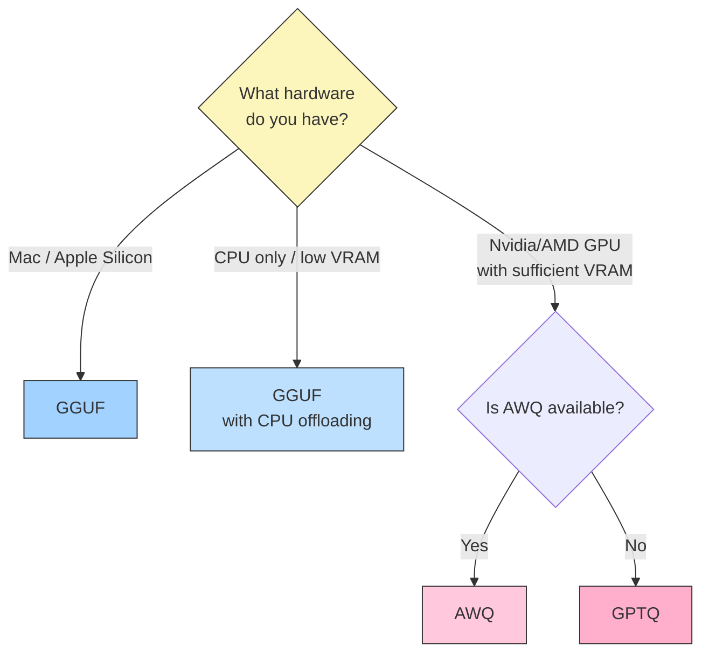

If you've ever tried to run a Large Language Model (LLM) locally, you've probably hit a common roadblock: **VRAM (Video RAM)**. 

A standard 7-billion parameter model in 16-bit precision (FP16) requires roughly 14GB–15GB of VRAM just to load its weights into memory, let alone context space for generation. For most consumer GPUs (which typically have 8GB to 12GB of VRAM), this makes running state-of-the-art open-source LLMs extremely difficult.

Enter **Quantization**.

In our previous post on [LLM Optimization](/posts/understanding-llm-optimization/), we touched on making models more efficient. Today, we're zooming in on *quantization*—the compression magic that allows massive AI models to run flawlessly on gaming PCs, MacBooks, and even Raspberry Pis.

## What is Quantization?

In simple terms, quantization is the process of reducing the precision of the numbers used to represent a model's weights. 

Neural networks typically use 16-bit floating-point formatting (FP16) or 32-bit (FP32). Quantization maps these high-precision numbers to lower-precision formats like 8-bit integers (INT8) or even 4-bit integers (INT4). 

Think of it like compressing an image. A raw 4K image file is enormous. If you convert it to a JPEG, you lose some pixel-perfect detail, but the file size shrinks drastically while still looking virtually identical to the human eye. In LLMs, reducing weights from 16-bit to 4-bit cuts the memory requirement by about **75%** with barely noticeable drops in the model's intelligence.

Let's look at the three most popular quantization formats you will encounter today: **GPTQ**, **AWQ**, and **GGUF**.

---

## 1. GPTQ (Generalized Post-Training Quantization)

**Best for:** Running models entirely on a GPU.

GPTQ was one of the first highly successful methods for compressing LLMs to 4-bit precision. It is a one-shot weight quantization method based on approximate second-order information. 

**How it works:** 
Instead of blindly rounding numbers, GPTQ looks at how rounding a specific weight affects the rest of the network and adjusts neighboring weights to compensate for the error. 

**Pros:**
* Highly optimized for GPU inference (via libraries like AutoGPTQ or ExLlamaV2).
* Excellent generation speed.
* Drastically reduces VRAM requirements (a 7B model fits inside 6GB of VRAM).

**Cons:**
* Only works well if you have a dedicated GPU (Nvidia/AMD). It is not designed for CPU inference.

---

## 2. AWQ (Activation-aware Weight Quantization)

**Best for:** GPU inference with slightly better accuracy than GPTQ.

AWQ is a newer approach that observed a crucial fact: **not all weights are equally important**. Typically, about 1% of the weights in an LLM are vastly more important to the model's performance than the rest.

**How it works:**
AWQ runs a small dataset through the model during the quantization process to observe which weights are used the most (the "activations"). It keeps those critical 1% of weights in higher precision (FP16) while compressing the remaining 99% into 4-bit formats.

**Pros:**
* Preserves the model's intelligence better than GPTQ, especially at very low bitrates.
* Incredibly fast generation speeds (often outperforming GPTQ in modern engines like vLLM).

**Cons:**
* Like GPTQ, it is inherently designed for GPUs.

---

## 3. GGUF (GPT-Generated Unified Format)

**Best for:** Running models on CPUs, MacBooks (Apple Silicon), or mixed CPU/GPU setups.

If you've heard of `llama.cpp`, you've interacted with GGUF (which replaced the older GGML format). GGUF wasn't just built for compression; it was built for maximum hardware compatibility.

**How it works:**
GGUF files store not just quantized weights, but all the metadata required to run the model in a single file. GGUF supports offloading layers. If your GPU has 8GB of VRAM but the model needs 12GB, GGUF will load 8GB onto the GPU and the remaining 4GB onto your system's normal RAM and CPU. 

**Pros:**
* **MacBook magic:** Heavily optimized for Apple's M1/M2/M3 chips, delivering staggering performance.
* **Flexibility:** Allows you to run LLMs even if you don't have a dedicated graphics card.
* **Many compression levels:** Lets you choose between 2-bit, 3-bit, 4-bit, 5-bit, 6-bit, and 8-bit formats to perfectly match your available RAM.

**Cons:**
* If you *do* have a high-end GPU with enough VRAM, GPTQ or AWQ will generally generate text faster than GGUF.

---

## Which One Should You Choose?

When you land on Hugging Face looking to download a model (like Llama-3 or Mistral), you'll often see the same model uploaded in all three formats. Here is your cheat sheet:

* **Do you have a Mac with an M-series chip?** Choose **GGUF**.
* **Do you only have a CPU, or a weak GPU with low VRAM?** Choose **GGUF** and offload what you can.
* **Do you have an Nvidia/AMD GPU with enough VRAM to hold the compressed model?** Choose **AWQ**.
* **Is AWQ not available, or are you using an older text-gen interface?** Choose **GPTQ**.

## Conclusion

Quantization is the great equalizer in the open-source AI community. It decoupled state-of-the-art LLMs from $10,000 server GPUs, bringing them into the hands of developers and hobbyists using off-the-shelf consumer hardware. As models get larger and smarter, techniques like AWQ and GGUF will only become more vital to the AI ecosystem.
