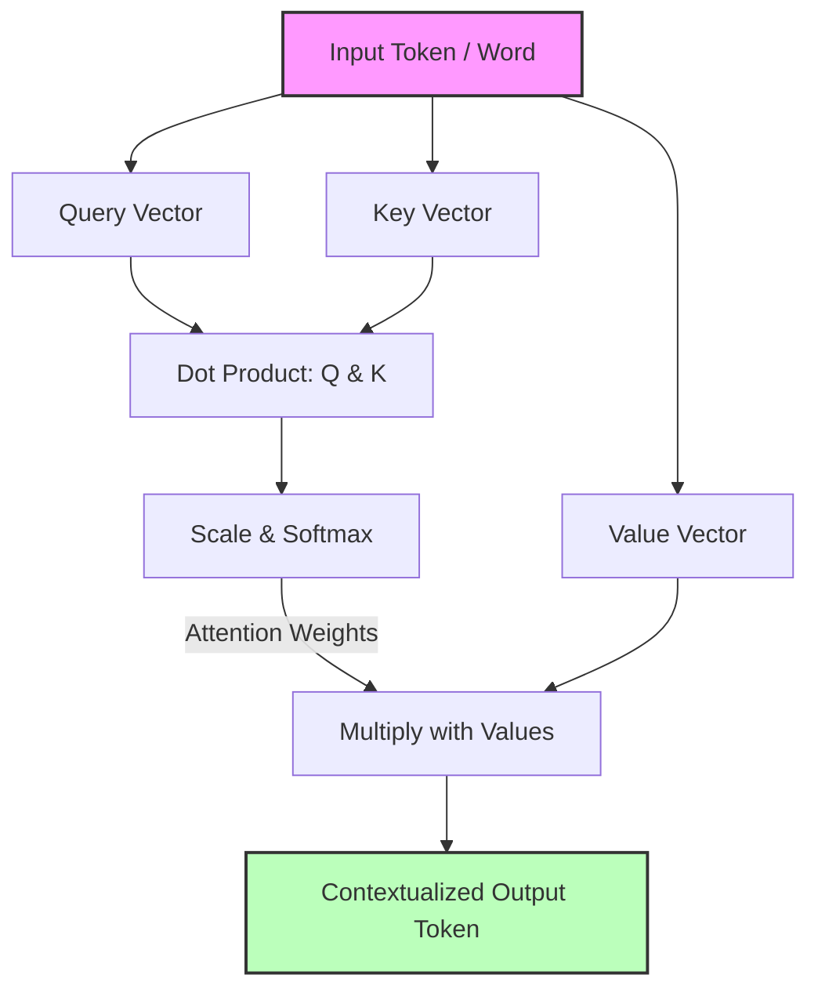
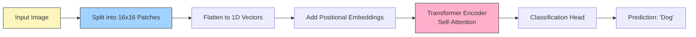

If you've been following the AI space over the last several years, you already know that **Transformers** run the world. They are the "T" in GPT, the engine beneath massive language models, and increasingly, the state-of-the-art architecture for analyzing images and video. 

But how does this architecture actually work? And how did a model originally designed to translate text end up dethroning Convolutional Neural Networks (CNNs) in computer vision? 

Today, we're diving into the core of the Transformer—**Self-Attention**—and exploring how it was adapted to see the world via **Vision Transformers (ViT)**.

---

## Part 1: Demystifying Self-Attention

Before 2017, generating text largely relied on Recurrent Neural Networks (RNNs) and LSTMs. These processed text sequentially, word by word. The longer the sentence, the harder it was for the network to "remember" the beginning of the sentence by the time it reached the end.

The paper *"Attention Is All You Need"* threw out sequential processing entirely. Instead, it allowed the model to look at **every word in a sentence simultaneously** and determine which words were most highly related to each other, regardless of their distance. This is called **Self-Attention**.

### The Library Analogy: Query, Key, and Value (Q, K, V)

Self-Attention computes context using three vectors for every word: a **Query** ($Q$), a **Key** ($K$), and a **Value** ($V$). 

Imagine you are at a library:
1. **Query ($Q$):** This is what you are looking for (e.g., "A book about neural networks").
2. **Key ($K$):** This is the title/tags on the spine of every book on the shelf (e.g., "Deep Learning Basics").
3. **Value ($V$):** This is the actual text inside the book.

When a word (like "bank") is processed, the model uses the **Query** of "bank" and compares it via a dot-product to the **Keys** of every other word in the sentence (like "river", "water", or "money", "finance"). If the sentence is "I sat by the river bank," the Keys for "river" and "water" will have a high similarity score with the Query for "bank", heavily weighting their **Values**. This tells the model that in this context, "bank" means the side of a river, not a financial institution.

Because this mechanism is purely matrix multiplication, it can be massively parallelized across GPUs, escaping the sequential bottleneck of old architectures!

---

## Part 2: Vision Transformers (ViT) Explained

For years, Convolutional Neural Networks (CNNs) were the undisputed kings of Computer Vision. They work by sliding small grids (filters) over an image, gradually building up an understanding of edges, textures, and eventually complex shapes like faces.

But in 2020, researchers at Google Brain asked a radical question: *What if we just treat an image exactly like a sentence?*

Thus, the **Vision Transformer (ViT)** was born.

### How ViT Works: Patches are the New Words

A Transformer encoder expects a sequence of 1D tokens (like words). But an image is a 2D grid of pixels. To bridge this gap, ViT chops the image into a grid of non-overlapping patches—typically 16x16 pixels each. 

1. **Patchify:** The image is cut into distinct squares.
2. **Linear Embedding:** Each patch is mathematically flattened into a 1D vector. Now, each patch acts exactly like a "word" in an NLP problem.
3. **Positional Encoding:** Because Transformers process everything at once, they have no concept of space. The model needs to be told *where* each patch came from (e.g., "This patch is the top-left corner"). We add positional data to the vectors.
4. **Transformer Encoder:** The sequence of patches is pushed through standard Self-Attention layers. The patches look at each other to construct a global understanding of the image.

### Why ViTs are Taking Over

CNNs have a strong **inductive bias**—they are explicitly designed to look for local pixel relationships (edges close to each other). This makes them great for training on smaller datasets.

Transformers have almost *no* inductive bias. They don't know that pixels next to each other are related. However, this lack of bias means that if you feed them **massive amounts of data**, they actually learn better, more complex global relationships than CNNs ever could. 

When trained on datasets with hundreds of millions of images, ViTs outperform state-of-the-art CNNs, requiring fewer computational resources to train at that massive scale.

## Summary

The Transformer's ability to contextualize everything everywhere all at once—first words in a paragraph, now patches in an image—has unified deep learning in a way few saw coming. Whether we are chatting with an LLM or generating art, under the hood, it's all just Queries, Keys, and Values doing the heavy lifting.