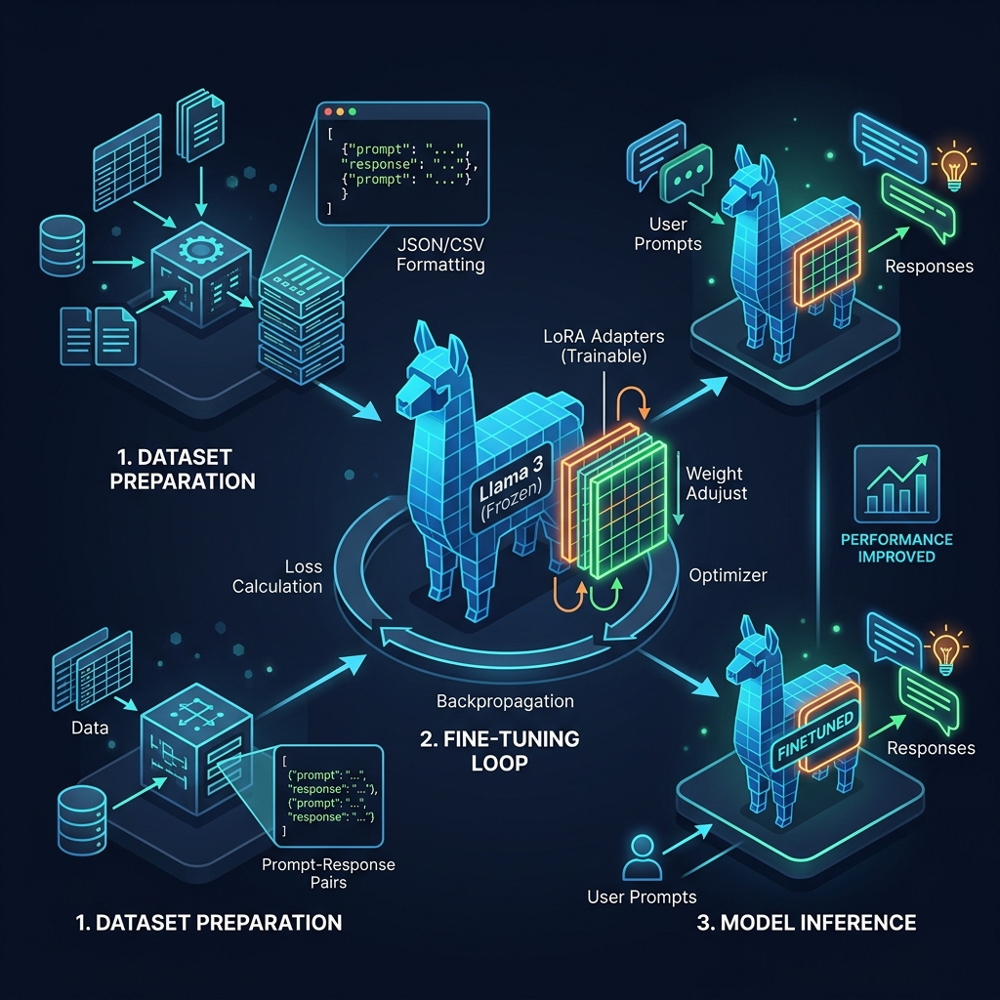

+++
date = '2026-04-12T10:00:00+05:30'
title = 'How to Fine-Tune Llama 3 on Your Own Data: A Practical Guide'
description = "Step-by-step practical guide to fine-tuning Meta's Llama 3 using PyTorch, Hugging Face Transformers, and PEFT/LoRA on a custom dataset."
tags = ['AI', 'Llama 3', 'Fine-tuning', 'LoRA', 'Hugging Face', 'PEFT']
categories = ['Technology']
series = ['AI Guides']
math = true
+++

In our [Simple Guide to LoRA](/posts/understanding-lora-fine-tuning/), we explored the theory behind **Low-Rank Adaptation** and how it slashes the GPU memory requirements for model training. 

Now, let's put theory into practice. In this guide, we'll walk through a step-by-step, hands-on tutorial to fine-tune **Meta's Llama 3 (8B)** on a custom dataset using Hugging Face, PEFT, and QLoRA (Quantized LoRA) on a single GPU.

---



---

### Step 1: Format Your Dataset

To train Llama 3, you need prompt-response pairs. Llama 3 uses a specific chat template format. For custom datasets, the easiest approach is to structure your data as a JSON file containing lists of messages:

```json
[
  {
    "messages": [
      {"role": "system", "content": "You are a helpful customer support assistant."},
      {"role": "user", "content": "How do I reset my password?"},
      {"role": "assistant", "content": "To reset your password, click 'Forgot Password' on the login screen, enter your email address, and follow the link sent to your inbox."}
    ]
  },
  {
    "messages": [
      {"role": "system", "content": "You are a helpful customer support assistant."},
      {"role": "user", "content": "What is your refund policy?"},
      {"role": "assistant", "content": "We offer a full refund within 30 days of purchase. Please contact support with your invoice to initiate the process."}
    ]
  }
]
```

Save this as `dataset.json`.

---

### Step 2: Set Up Your Environment

You will need a GPU with at least 12–16 GB of VRAM (such as an RTX 3090, 4080, or A10G). First, install the required libraries:

```bash
pip install -q -U transformers datasets accelerate peft trl bitsandbytes
```

---

### Step 3: Load the Model with 4-bit Quantization (QLoRA)

To make fine-tuning even more efficient, we combine LoRA with 4-bit quantization, a method known as **QLoRA**. We use the `bitsandbytes` library to load the base Llama 3 model in 4-bit precision, leaving plenty of memory for training:

```python
import torch
from transformers import AutoModelForCausalLM, AutoTokenizer, BitsAndBytesConfig

model_id = "meta-llama/Meta-Llama-3-8B-Instruct"

# 1. Configure 4-bit quantization
bnb_config = BitsAndBytesConfig(
    load_in_4bit=True,
    bnb_4bit_quant_type="nf4",
    bnb_4bit_compute_dtype=torch.bfloat16,
    bnb_4bit_use_double_quant=True
)

# 2. Load the base model and tokenizer
tokenizer = AutoTokenizer.from_pretrained(model_id)
tokenizer.pad_token = tokenizer.eos_token
tokenizer.padding_side = "right" # Important for instruction-following models

model = AutoModelForCausalLM.from_pretrained(
    model_id,
    quantization_config=bnb_config,
    device_map="auto"
)
```

---

### Step 4: Configure the LoRA Adapters

Next, we configure our trainable Low-Rank matrices. We specify which layers in the Transformer to target (mostly the projection layers in the self-attention blocks):

```python
from peft import LoraConfig, get_peft_model

peft_config = LoraConfig(
    r=16,                       # Rank matrix size
    lora_alpha=32,              # Scaling parameter
    lora_dropout=0.05,
    bias="none",
    task_type="CAUSAL_LM",
    target_modules=["q_proj", "k_proj", "v_proj", "o_proj", "gate_proj", "up_proj", "down_proj"]
)
```

---

### Step 5: Start the Training Loop

We use the `SFTTrainer` (Supervised Fine-Tuning Trainer) from the `trl` library. It handles formatting the dataset using Llama 3's chat template and manages the training steps seamlessly:

```python
from datasets import load_dataset
from trl import SFTTrainer
from transformers import TrainingArguments

# Load the local dataset
dataset = load_dataset("json", data_files="dataset.json", split="train")

# Define training parameters
training_args = TrainingArguments(
    output_dir="./results",
    num_train_epochs=3,
    per_device_train_batch_size=4,
    gradient_accumulation_steps=2,
    optim="paged_adamw_8bit",    # Memory-optimized optimizer
    learning_rate=2e-4,
    weight_decay=0.001,
    fp16=False,
    bf16=True,                  # Use bfloat16 for Llama 3 if your GPU supports it
    logging_steps=10,
    save_strategy="epoch",
    report_to="none"            # Change to "wandb" or "tensorboard" if desired
)

# Initialize trainer
trainer = SFTTrainer(
    model=model,
    train_dataset=dataset,
    peft_config=peft_config,
    dataset_text_field="messages",
    max_seq_length=512,         # Set max length based on dataset requirements
    tokenizer=tokenizer,
    args=training_args,
)

# Run the training loop!
trainer.train()
```

---

### Step 6: Save and Test the Tuned Model

Once training is complete, save the tiny trained adapter weights (only about 50-100 MB):

```python
trainer.model.save_pretrained("./llama3-custom-support")
tokenizer.save_pretrained("./llama3-custom-support")
```

To run inference, load the base model and then load the adapter weights on top:

```python
from peft import PeftModel

# Load base model
base_model = AutoModelForCausalLM.from_pretrained(model_id, quantization_config=bnb_config, device_map="auto")

# Merge adapter weights
finetuned_model = PeftModel.from_pretrained(base_model, "./llama3-custom-support")
```

---

### Conclusion

Congratulations! You have successfully fine-tuned Llama 3 on your own data. Because we used QLoRA, this whole process can run on a single 16GB GPU in under an hour for small datasets, keeping memory usage minimal. 

What custom dataset are you planning to fine-tune Llama 3 on? Let us know in the comments!

---

*This post is part of the [AI Guides series](/series/ai-guides/). Check out the [Simple Guide to LoRA](/posts/understanding-lora-fine-tuning/) and [A Simple Guide to LLM Serving](/posts/understanding-llm-optimization/) for more guides on deep learning.*
