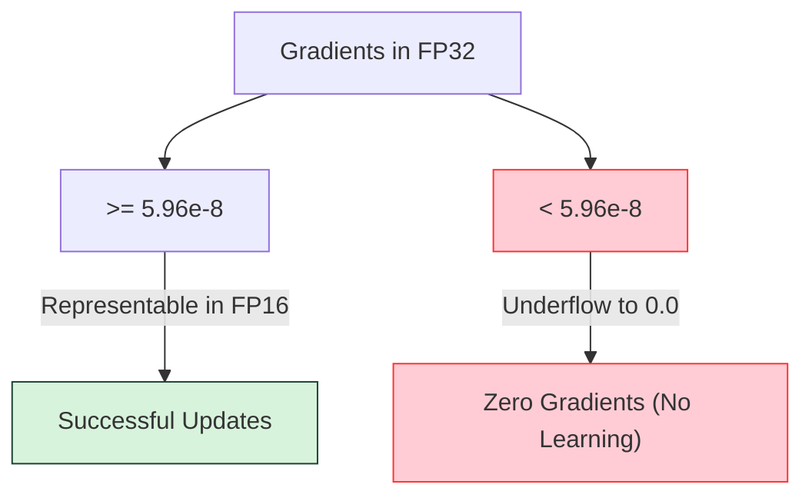
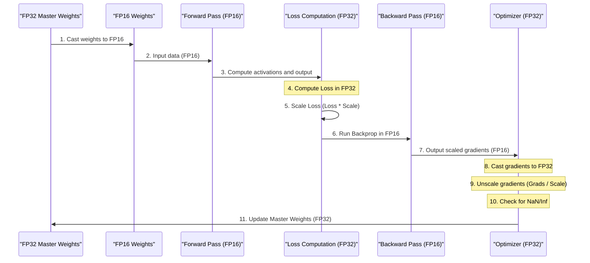

+++
date = '2026-07-27T15:00:00+05:30'
title = 'Demystifying Mixed Precision Training: Speeding Up Deep Learning with FP16 and BF16'
description = 'An in-depth guide on how mixed precision training works, the mathematics of loss scaling, the difference between FP16 and BF16, and how to implement it in PyTorch.'
tags = ['AI', 'Deep Learning', 'PyTorch', 'Optimization', 'Mixed Precision']
categories = ['Technology']
series = ['AI Guides']
math = true
+++

As deep learning models continue to scale into billions of parameters, training them has become an incredibly resource-intensive endeavor. If you have ever trained a large convolutional neural network or a Transformer model, you have likely run into the dreaded out-of-memory (OOM) error on your GPU. 

Traditionally, deep learning computations are performed in **Single Precision** (also known as **FP32**), where every weight, activation, and gradient is represented by a 32-bit floating-point number. While FP32 provides high numerical precision, it consumes significant memory and bandwidth.

**Mixed Precision Training** is a highly effective optimization technique that slashes training times and memory consumption by utilizing both 16-bit (half-precision) and 32-bit floating-point formats. When implemented correctly, it can speed up training by **2x to 3x** and reduce the model's memory footprint by **up to 50%**, with virtually **no loss in final accuracy**.

In this guide, we will dive deep into how mixed precision training works under the hood, the math behind loss scaling, the crucial differences between **FP16** and **BF16**, and how to implement it in PyTorch using Automatic Mixed Precision (AMP).

---

## 1. Numerical Formats: FP32 vs. FP16 vs. BF16

To understand mixed precision training, we first need to look at how computers represent real numbers using the IEEE 754 standard. A floating-point number is stored in binary using three components:
1. **Sign bit**: Determines whether the number is positive or negative.
2. **Exponent**: Determines the magnitude/dynamic range of the number.
3. **Fraction (Mantissa/Significand)**: Determines the precision or resolution of the number.

```mermaid
graph TD
    subgraph FP32 ["FP32 (Single Precision - 32 bits)"]
        S32["Sign (1 bit)"] --- E32["Exponent (8 bits)"] --- F32["Fraction / Mantissa (23 bits)"]
    end
    subgraph FP16 ["FP16 (Half Precision - 16 bits)"]
        S16["Sign (1 bit)"] --- E16["Exponent (5 bits)"] --- F16["Fraction / Mantissa (10 bits)"]
    end
    subgraph BF16 ["BF16 (Brain Float - 16 bits)"]
        SB16["Sign (1 bit)"] --- EB16["Exponent (8 bits)"] --- FB16["Fraction / Mantissa (7 bits)"]
    end
    
    style FP32 fill:#d1e7dd,stroke:#0f5132,stroke-width:2px
    style FP16 fill:#f8d7da,stroke:#842029,stroke-width:2px
    style BF16 fill:#fff3cd,stroke:#664d03,stroke-width:2px
```



Here is a comparison of their layout and characteristics:

| Format | Total Bits | Exponent Bits | Mantissa Bits | Smallest Positive Normal Number | Largest Representable Number | Precision (Decimal Digits) |
| :--- | :---: | :---: | :---: | :---: | :---: | :---: |
| **FP32** | 32 | 8 | 23 | $1.18 \times 10^{-38}$ | $3.40 \times 10^{38}$ | ~7.2 |
| **FP16** | 16 | 5 | 10 | $6.10 \times 10^{-5}$ | $6.55 \times 10^{4}$ | ~3.3 |
| **BF16** | 16 | 8 | 7 | $1.18 \times 10^{-38}$ | $3.39 \times 10^{38}$ | ~2.1 |

### FP16 (Half Precision)
FP16 uses half the bits of FP32. While this means half the memory transfer time and double the arithmetic throughput on modern Tensor Cores, it comes with a major catch: its **dynamic range** is extremely narrow. The largest number it can represent is only **65,504**, and anything smaller than $6.10 \times 10^{-5}$ (or $5.96 \times 10^{-8}$ for subnormal/denormal numbers) underflows to zero.

### BF16 (Brain Floating Point)
Developed by Google Brain, BF16 is an alternative 16-bit format designed specifically for machine learning. Instead of shrinking both the exponent and mantissa, BF16 keeps the **exact same exponent size as FP32 (8 bits)** but sacrifices mantissa bits (reduced to 7). 

Because it has the same exponent size, **BF16 has the same dynamic range as FP32**. This means you can convert FP32 numbers to BF16 without worrying about overflow or underflow. However, because its mantissa is smaller, it has slightly lower precision than FP16.

---

## 2. Why Naive Half-Precision Training Fails

It is tempting to simply cast all model weights and inputs to FP16 and train the network. However, doing so almost always results in training instability or complete failure (divergent loss). This happens due to two primary issues:

### Issue A: Gradient Underflow
During backpropagation, gradients flow backward through the network. In deep networks, gradients tend to become progressively smaller (especially in early layers). 

In FP16, any gradient value smaller than $2^{-24}$ ($\approx 5.96 \times 10^{-8}$) becomes exactly zero. When these gradients underflow, the weights in those layers stop updating, effectively killing the training process. Studies show that in many state-of-the-art networks, more than **50% of the gradients** lie in this underflow region.



### Issue B: The Magnitude Mismatch (Tiny Updates)
The standard gradient update formula is:
$$W_{new} = W_{old} - \eta \cdot \nabla L$$

Where $\eta$ is the learning rate and $\nabla L$ is the gradient. Because $\eta$ is typically small (e.g., $10^{-4}$), the update term $\eta \cdot \nabla L$ is extremely small relative to the weight value $W_{old}$. 

In FP16, if the difference in magnitude between two numbers is too large, the smaller number cannot be represented when added to the larger one. For example, if $W_{old} = 1.0$ and the update is $10^{-4}$, the limited mantissa of FP16 (only 10 bits) cannot represent the sum accurately. The update gets rounded to zero, and the weight remains unchanged.

---

## 3. The Three Pillars of Mixed Precision Training

To solve the limitations of FP16, researchers at NVIDIA and Baidu introduced three key techniques in their seminal 2017 paper, *"Mixed Precision Training"*:

### 1. FP32 Master Weights
While computations are done in FP16 for speed, we maintain a **master copy of the weights in FP32**. 

During each training iteration:
- The FP32 master weights are copied/casted to FP16.
- The forward pass and backward pass are performed using the FP16 weights, generating FP16 gradients.
- During the optimization step, the FP16 gradients are cast back to FP32.
- The optimizer updates the FP32 master weights using these FP32 gradients.

This ensures that tiny weight updates are not lost due to magnitude mismatch, as the accumulation always happens in high-precision FP32.

### 2. Loss Scaling (Underflow Prevention)
To prevent gradient underflow, we scale the loss by a factor $S$ (typically a large power of 2, like $65,536$) before backpropagation.

By the chain rule, scaling the loss scales all subsequent gradients by the same factor $S$:
$$\nabla_{W} (S \cdot L) = S \cdot \nabla_{W} L$$

This mathematically shifts the entire gradient distribution to the right, pushing the small gradients out of the underflow zone and into the representable range of FP16. 

After backpropagation, but *before* the optimizer updates the weights, we must **unscale** the gradients by dividing them by $S$:
$$\text{Updated Gradients} = \frac{\text{Scaled Gradients}}{S}$$

This ensures the weights are updated using the correct, original gradient values.

### 3. Dynamic Loss Scaling
Using a static scaling factor $S$ can be problematic: too small, and gradients still underflow; too large, and gradients overflow (becoming `Inf` or `NaN`), ruining the weights.

**Dynamic Loss Scaling** solves this by adjusting the scale factor automatically:
1. Start with a very high scale factor (e.g., $2^{16}$).
2. Perform backpropagation and check if any gradient contains `Inf` or `NaN`.
3. If an overflow is detected:
   - Discard the entire step (do not update weights).
   - Decrease the scale factor (e.g., divide by 2).
4. If no overflow is detected:
   - Accept the step and update the weights.
   - If no overflows occur for a consecutive number of steps (e.g., 2000 steps), increase the scale factor (e.g., multiply by 2) to keep it as large as possible.

---

## 4. The Mixed Precision Training Workflow

Putting it all together, here is how a single training iteration flows under mixed precision:



---

## 5. Implementing Mixed Precision in PyTorch

In PyTorch, implementing mixed precision training is extremely easy thanks to the `torch.cuda.amp` (Automatic Mixed Precision) package. It provides two main utilities:
1. `torch.cuda.amp.autocast`: Automatically handles casting tensors to FP16 for operations that benefit from it (like matrix multiplications and convolutions) while keeping numerical-critical operations (like softmax, layer normalization, and loss functions) in FP32.
2. `torch.cuda.amp.GradScaler`: Manages dynamic loss scaling.

Let's compare a standard training loop with a mixed precision training loop.

### Standard Training Loop (FP32)
```python
import torch

model = MyModel().cuda()
optimizer = torch.optim.Adam(model.parameters(), lr=1e-3)

for inputs, targets in dataloader:
    inputs, targets = inputs.cuda(), targets.cuda()
    
    optimizer.zero_grad()
    
    # Forward pass
    outputs = model(inputs)
    loss = criterion(outputs, targets)
    
    # Backward pass
    loss.backward()
    
    # Optimizer step
    optimizer.step()
```

### Mixed Precision Training Loop (FP16 + AMP)
```python
import torch
# 1. Import autocast and GradScaler
from torch.cuda.amp import autocast, GradScaler

model = MyModel().cuda()
optimizer = torch.optim.Adam(model.parameters(), lr=1e-3)

# 2. Initialize the gradient scaler
scaler = GradScaler()

for inputs, targets in dataloader:
    inputs, targets = inputs.cuda(), targets.cuda()
    
    optimizer.zero_grad()
    
    # 3. Use autocast context manager for forward pass
    with autocast():
        outputs = model(inputs)
        loss = criterion(outputs, targets)
    
    # 4. Scale the loss and run backward pass
    scaler.scale(loss).backward()
    
    # 5. Step the optimizer through the scaler
    scaler.step(optimizer)
    
    # 6. Update the scale factor for the next iteration
    scaler.update()
```

### What does the `GradScaler` do in the loop?
- `scaler.scale(loss)` multiplies the loss by the current scale factor.
- `scaler.scale(loss).backward()` computes the scaled gradients.
- `scaler.step(optimizer)` first unscales the gradients (`gradients / scale`). If the unscaled gradients do not contain `NaN` or `Inf`, it executes `optimizer.step()`. If they do contain invalid numbers, the step is skipped.
- `scaler.update()` adjusts the scale factor based on whether overflows were detected in the step.

---

## 6. FP16 vs. BF16: Which Should You Use?

With modern GPUs (NVIDIA Ampere architecture and newer, such as the RTX 30/40 series, A100, and H100), **BF16** has become the preferred choice over FP16. 

Here is why:
* **No Loss Scaling Required**: Because BF16 has the same dynamic range as FP32, it does not suffer from gradient underflow. You can completely omit the `GradScaler` in PyTorch!
* **Simpler Implementation**: In PyTorch, you simply set the dtype of `autocast` to `torch.bfloat16` and train without a scaler:

```python
# Training with BF16 (No GradScaler needed!)
for inputs, targets in dataloader:
    optimizer.zero_grad()
    
    with autocast(dtype=torch.bfloat16):
        outputs = model(inputs)
        loss = criterion(outputs, targets)
        
    loss.backward()
    optimizer.step()
```

### The Selection Rule of Thumb

* **Use BF16** if you are training on an NVIDIA Ampere or Hopper GPU (RTX 30xx/40xx, A100, H100) or Google TPUs. It is faster, more stable, and easier to write.
* **Use FP16 with Loss Scaling** if you are training on older GPUs (NVIDIA Volta or Turing architecture, like the V100, T4, or RTX 20xx series). These cards do not have hardware support for BF16, so using it will cause PyTorch to fall back to CPU emulation, making training extremely slow.

---

## Conclusion

Mixed precision training is one of the most accessible and impactful optimizations in modern deep learning. By strategically combining 16-bit float formats (FP16/BF16) for compute-heavy operations and 32-bit float formats (FP32) for precision-critical operations, you can:
* Cut your GPU memory usage in half, allowing for **larger batch sizes** or **larger models**.
* Speed up training loops by **2x to 3x** on hardware with Tensor Cores.
* Maintain the same convergence behavior and model accuracy.

If you are training on modern hardware, try switching your training loop to BF16 today. It requires changing just a single line of code and will instantly unlock the full power of your GPU.

---

*This post is part of the [AI Guides series](/series/ai-guides/). Check out the [Beginner's Guide to LLM Quantization](/posts/beginners-guide-to-llm-quantization/) and [Simple Guide to LoRA](/posts/understanding-lora-fine-tuning/) for more guides on deep learning optimization.*
