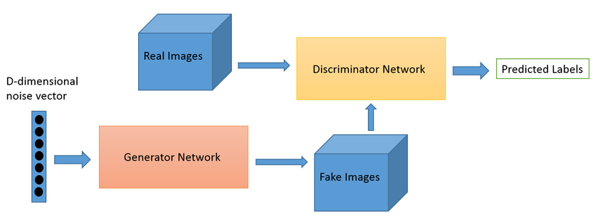
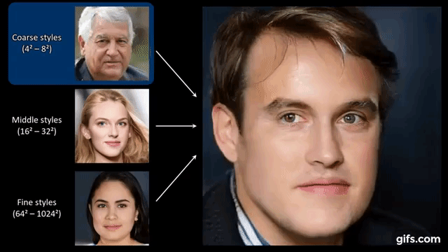
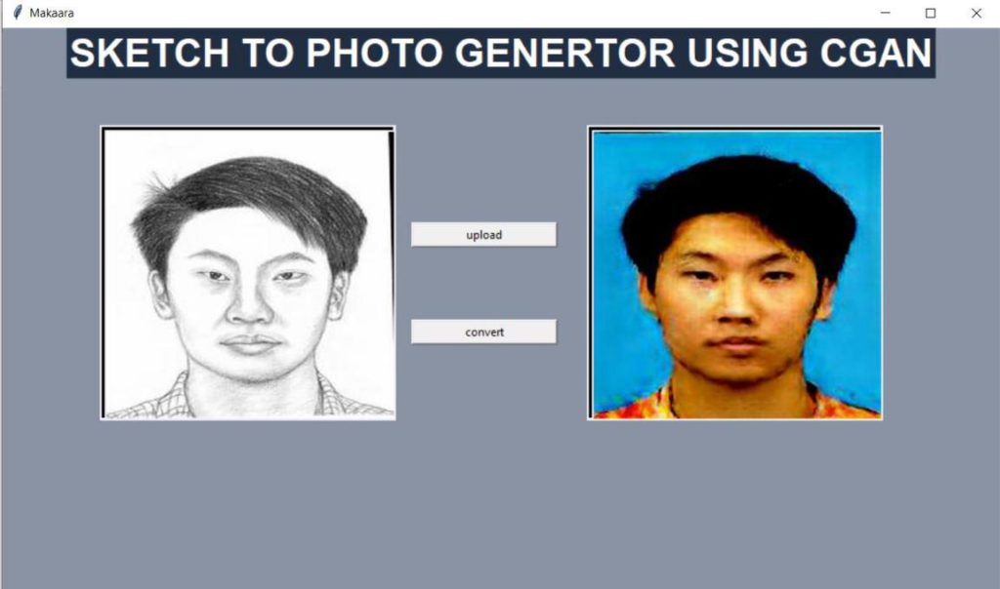
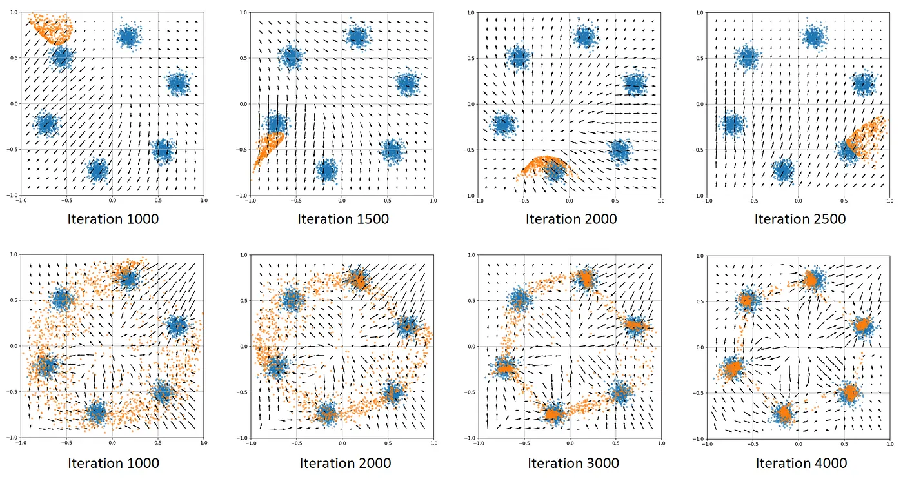

+++
date = '2025-08-21T08:52:47+05:30'
title = 'A Simple Guide to GANs'
description = 'Understand the core concepts of GANs, how they work, and their applications in AI.'
tags = ['AI', 'GANs', 'Machine Learning', 'Deep Learning']
categories = ['Technology']
+++

Have you ever seen a photo of a person who doesn't exist? Or a painting so unique you can't believe a human didn't make it? Chances are, you were looking at the work of a **GAN**, one of the most creative and fascinating ideas in modern artificial intelligence.

But what *is* a GAN? The name, **Generative Adversarial Network**, sounds incredibly complex. In reality, the core idea is a brilliant and surprisingly simple story of competition.

### The Forger and The Critic: How GANs Work

Imagine a game between two players:

> **The Forger (The "Generator")**: This player is an aspiring art forger. Their goal is to create a fake Picasso painting. At first, their paintings are terrible just random splotches of paint. They have no idea what a Picasso looks like; they're just guessing.

> **The Critic (The "Discriminator")**: This player is a world-class art critic. Their job is to tell the difference between a real Picasso and a fake.

Here's how they play:

1.  **Round 1**: The Forger (Generator) creates a messy, random painting and shows it to the Critic. The Critic also looks at a real Picasso. The Critic easily says, "That's a fake. It's terrible."

2.  **Feedback**: The Critic tells the Forger *why* it looked fake. "The lines are all wrong, the colors are muddy, and it doesn't look like a face."

3.  **Round 2**: The Forger takes this feedback and tries again. This time, the painting is slightly better. Maybe it has some lines that look a bit more intentional. The Critic looks at it and says, "Still fake. But I see you tried to make an eye this time."

This game continues for thousands, even millions, of rounds. The **Forger** gets better and better at creating fakes, while the **Critic** gets better and better at spotting them.

Eventually, the Forger (Generator) becomes so good that they create a painting the Critic (Discriminator) can't tell apart from a real Picasso. The Critic looks at the fake and says, "I'm only 50/50 on this. I... I'm not sure."

At this point, the game is over. The Forger has won. We can now throw away the Critic and use the Forger this master **Generator** to create an endless supply of new, convincing "Picasso" paintings.

That's a GAN. It's two AI networks (the **Generator** and **Discriminator**) locked in an *adversarial* competition, constantly pushing each other to improve until the Generator can create new, realistic data all on its own.

### What Can This "AI Forger" Actually Do?

This simple concept of "learning by competing" has unlocked some incredible abilities. GANs are the creative engine behind many AI applications you see today.

-   **Creating Hyper-Realistic Faces**: This is the most famous example. Websites like "This Person Does Not Exist" use a GAN (specifically, a model called StyleGAN) to generate endless, photorealistic faces of people who have never lived.

    

-   **Image-to-Image Translation**: GANs can "translate" an image from one style to another. They can turn a satellite photo into a Google Map, a daytime photo into a nighttime one, or even a simple sketch into a photorealistic landscape.

    

-   **Creating "Deepfakes"**: This is a more controversial use. By training on videos of a person, a GAN can learn to map their face onto another person's body and mimic their expressions, creating highly realistic (and potentially deceptive) videos.

-   **Improving Old Media**: A GAN can be trained to turn low-resolution, grainy photos or videos into sharp, high-definition versions. It "imagines" the missing details with stunning accuracy.

-   **Data Augmentation**: Imagine you're training an AI to detect a rare disease, but you only have 100 medical scans. A GAN can "dream up" thousands of new, synthetic scans to help train a more robust AI, all without needing more real patients.

-   **Art & Design**: GANs are used to create abstract art, design logos, and even generate new fashion designs.

### Why Is It So Hard to Train a GAN?

While the idea is simple, getting the "Forger" and the "Critic" to learn in harmony is extremely difficult. It's a delicate balancing act that can easily go wrong.

**Training Instability**: The "game" can easily collapse.

-   **If the Critic is too good**: It spots every fake instantly and tells the Forger, "You're just bad." The Forger gets no useful feedback and never learns. This is called *vanishing gradients*.

-   **If the Forger is too good**: It quickly finds one "trick" that fools the Critic, and the Critic never catches up. The whole system stops improving.

**Mode Collapse**: This is the most common and interesting failure. The Forger (Generator) discovers one "easy win" and sticks with it. For example, if you're training a GAN to create all kinds of dogs, it might discover that it's really good at making convincing Golden Retrievers. Because this one trick fools the Critic, the Generator stops trying to create Corgis, Poodles, or Beagles. It just produces an endless stream of Golden Retrievers. It has "collapsed" onto a single mode.

Despite these challenges, researchers are constantly finding new ways to make GANs more stable and powerful. They are a fundamental building block of modern creative AI, proving that a little friendly competition can lead to incredible results.

Reference Links
1. https://www.researchgate.net/figure/Overview-of-a-simple-GAN-architecture_fig1_364708363

2. https://www.kdnuggets.com/2020/03/generate-realistic-human-face-using-gan.html

3. https://aihubprojects.com/forensic-sketch-to-image-generator-using-gan/

4. https://pub.towardsai.net/gan-mode-collapse-explanation-fa5f9124ee73