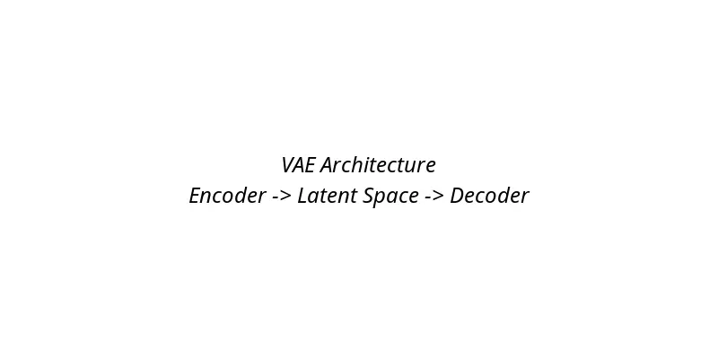

+++
date = '2025-11-30T10:00:00+05:30'
title = 'A Simple Guide to Variational Autoencoders (VAEs)'
description = 'Dive into the world of VAEs, understand how they generate new data, and explore their applications in AI.'
tags = ['AI', 'VAEs', 'Machine Learning', 'Deep Learning', 'Generative Models']
categories = ['Technology']
series = ['AI Guides']
+++

Have you ever wondered how AI can create new images, music, or even text that feels original? One powerful tool in the generative AI toolbox is the **Variational Autoencoder (VAE)**. While GANs (Generative Adversarial Networks) pit two networks against each other, VAEs take a different approach, focusing on learning the underlying structure of data.

In this guide, we'll break down VAEs in simple terms, explore how they work, and see their real-world applications.

### What is a Variational Autoencoder?

At its core, a VAE is a type of neural network designed to **learn a compressed representation** of data and then **reconstruct it**. Think of it as a smart compression algorithm that can also generate new content.

VAEs are inspired by **autoencoders**, which are neural networks that learn to encode input data into a lower-dimensional space (the "latent space") and then decode it back to the original form. The key difference with VAEs is the "variational" part, which introduces probabilistic elements to make the latent space more structured and generative.

### How VAEs Work: Encoder and Decoder

A VAE consists of two main components:

1. **The Encoder**: This part takes your input data (like an image) and compresses it into a **latent vector** in a lower-dimensional space. But instead of a single point, the encoder outputs a **distribution** (usually Gaussian) over possible latent vectors. This adds variability and helps with generation.

2. **The Decoder**: This takes a latent vector from the latent space and reconstructs the original data. During training, the decoder learns to generate data that looks like the input.

The training process involves:

- **Reconstruction Loss**: Ensures the decoded output matches the input.
- **KL Divergence Loss**: Keeps the latent distributions close to a standard normal distribution, making the latent space smooth and continuous.

This balance allows VAEs to not only reconstruct data but also **interpolate** between points in latent space, creating new, realistic samples.

### Generating New Data with VAEs

Once trained, VAEs can generate new data by:

1. Sampling a random point from the latent space (following the learned distribution).
2. Feeding it through the decoder to produce new output.

For example, if trained on faces, sampling different latent vectors can generate diverse, realistic faces. Unlike GANs, VAEs tend to produce smoother, more varied outputs without the adversarial training instability.

### Applications of VAEs

VAEs have found applications in various fields:

- **Image Generation**: Creating new images or editing existing ones (e.g., changing hairstyles or expressions).
- **Anomaly Detection**: Learning normal data distributions to spot outliers.
- **Dimensionality Reduction**: Similar to PCA but nonlinear and generative.
- **Drug Discovery**: Generating molecular structures.
- **Text and Music Generation**: Adapting VAEs for sequential data.

One famous example is **β-VAE**, which emphasizes disentangled representations, allowing control over specific features (e.g., changing only the color of a generated image).

### VAEs vs. GANs: When to Use What?

- **VAEs**: Better for stable training, interpretable latent spaces, and tasks requiring smooth interpolation. They can be less sharp than GANs.
- **GANs**: Excel at high-quality, photorealistic generation but can be harder to train and may suffer from mode collapse.

In practice, many modern models combine elements of both!

### Conclusion

Variational Autoencoders offer a elegant way to model data distributions and generate new content. By learning probabilistic latent representations, VAEs provide a foundation for many generative tasks. If you're interested in diving deeper, experiment with VAEs using libraries like TensorFlow or PyTorch.

What generative model are you most excited about? Let me know in the comments!

---

*This post is part of the [AI Guides series](/series/ai-guides/). Check out the [Simple Guide to GANs](/posts/simple-guide-to-gans/) for another take on generative models.*