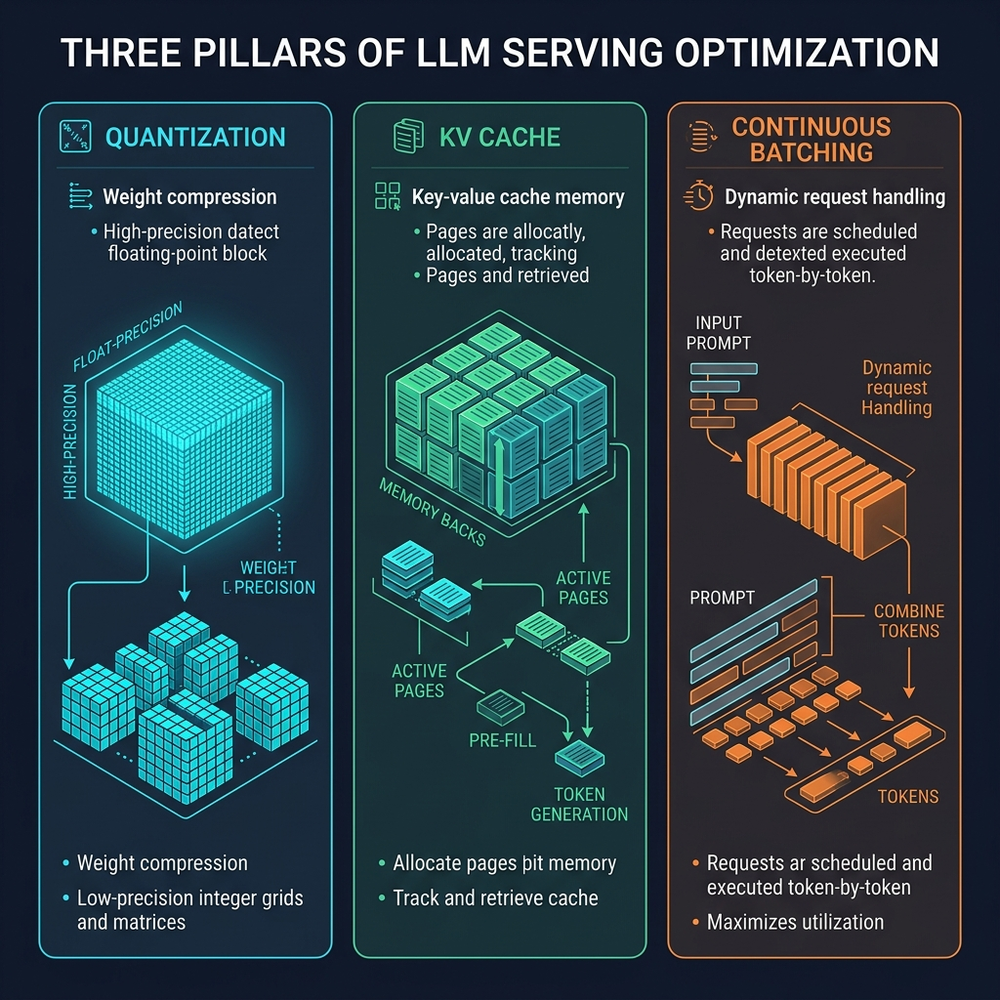

+++
date = '2026-05-10T10:00:00+05:30'
title = 'A Simple Guide to LLM Serving: Quantization, KV Caching, and Continuous Batching'
description = 'Dive into the three key techniques that make serving large language models (LLMs) fast, cheap, and memory-efficient.'
tags = ['AI', 'LLMs', 'Quantization', 'Inference', 'Optimization']
categories = ['Technology']
series = ['AI Guides']
math = true
+++

When you type a prompt into ChatGPT or Claude, the model generates a response word-by-word (or token-by-token) in real-time. Behind this smooth user interface lies a massive engineering challenge: **LLM Inference is incredibly expensive and slow.**

If you run a base LLM without optimizations, it will devour your GPU memory, process requests one-by-one, and make your users wait. To solve this, developers and researchers use three core serving techniques that work in tandem to speed up generation by up to 10x while drastically cutting hardware costs.

In this guide, we will break down the **Three Pillars of LLM Serving Optimization**: Quantization, KV Caching, and Continuous Batching.

---



---

### Pillar 1: Weight Quantization (Model Compression)

Before a model even starts processing requests, it has to fit into GPU memory. An unquantized 70-billion parameter model (like Llama 3 70B) in standard 16-bit floating-point (FP16) precision requires **140 GB of VRAM** just to load. That means you need multiple high-end enterprise GPUs just to start the model.

**Weight Quantization** is the process of compressing the model weights by reducing their numerical precision—for example, converting weights from 16-bit floats to 8-bit floats (FP8) or even 4-bit integers (INT4).

#### The Analogy: Shrinking a Photo
Think of quantization like saving a high-definition, uncompressed image as a JPEG. Yes, you lose a tiny bit of pixel detail, but the file size shrinks by 90%. 
* In neural networks, weights represent connections. By mapping a wide scale of floating-point numbers to a smaller set of integers (e.g., mapping numbers between -1.0 and 1.0 to integers from -8 to 7 in 4-bit), we shrink the memory footprint.

With **Post-Training Quantization (PTQ)** methods like AWQ (Activation-aware Weight Quantization) or GPTQ, we can compress a 70B model down to INT4. It now only requires **~35 GB of VRAM**, allowing it to fit onto a single consumer-grade card or a single enterprise GPU with virtually zero loss in accuracy.

---

### Pillar 2: KV Cache Optimization (Memory Overheads)

Once the model fits in VRAM, the next bottleneck is text generation itself. 

During generation, an LLM predicts one token at a time. To predict token $N$, the model needs to attend to all previous $N-1$ tokens. Instead of recalculating the mathematical representations (Keys and Values) of all previous tokens on every single step, we store them in GPU memory. This storage is called the **KV Cache (Key-Value Cache)**.

#### The Bottleneck: Dynamic Growth
While the KV Cache speeds up computation, it introduces a major memory problem:
1. **Dynamic Size**: The KV Cache grows with every generated token. A single request with a long prompt and long output can take up gigabytes of cache space.
2. **Fragmentation**: Because traditional systems allocate static, contiguous chunks of memory for each request's cache, a lot of memory is wasted (fragmented) when requests don't use their full allocated limit.

#### The Solution: PagedAttention
Popularized by the **vLLM** project, **PagedAttention** solves this by borrowing a classic operating system concept: virtual memory paging. 

Instead of allocating contiguous space for the KV cache of a request, PagedAttention breaks the KV Cache into small, fixed-size physical blocks (pages). These pages are mapped dynamically to virtual addresses. The memory no longer needs to be contiguous, eliminating **96% of memory fragmentation** and allowing serving engines to pack up to 4x more concurrent requests into the same GPU.

Additionally, we can apply **KV Cache Quantization** (e.g. compressing cache values from FP16 to FP8) to halve the memory footprint of the cache itself, saving even more VRAM for long-context windows.

---

### Pillar 3: Continuous Batching (Scheduling Optimization)

To handle multiple users efficiently, a serving engine must batch requests together. However, traditional batching (static batching) fails miserably with LLMs.

Because LLMs generate text token-by-token, and different requests require different output lengths, static batching creates a massive inefficiency. If User A asks for a 10-token haiku and User B asks for a 500-token essay:
* Under **Static Batching**, the GPU groups their requests together.
* The GPU must wait for User B's essay to completely finish before it can return User A's haiku. User A is left waiting, and the GPU wastes computation cycles processing "padding" tokens for User A's already-completed request.

```text
Static Batching:
[Prompt A] -> [Token 1] -> [Token 2] -> (Done) -> [PAD] ... -> [PAD] (Wait for B) -> Output A & B
[Prompt B] -> [Token 1] -> [Token 2] -> [Token 3] .............. -> [Token 500] (Done)
```

#### The Solution: Continuous Batching (Iteration-Level)
Continuous batching schedules requests at the **iteration level** (on every single token generation step). 

Instead of waiting for the entire batch to finish, a continuous batching engine can:
1. Immediately return User A's output as soon as it generates the "End of Text" token.
2. Dynamically insert a new incoming request (User C) into the batch in place of User A on the very next token iteration.

```text
Continuous Batching:
Step 1: Process [A] and [B]
Step 2: [A] is Done! Output A.
Step 3: Insert [C]. Process [B] and [C] together.
```

This eliminates idle GPU time and increases the throughput of the server by up to **4x**.

---

### Putting It All Together

These three optimizations complement each other perfectly:
* **Quantization** shrinks the base model weights, leaving more VRAM open for user requests.
* **KV Caching & PagedAttention** ensures that the open VRAM is used efficiently without memory fragmentation or waste.
* **Continuous Batching** dynamically fills the pipeline on every token step, maximizing GPU utilization.

When deployed together in modern engines like vLLM, TensorRT-LLM, or TGI, LLMs can be served at a fraction of the cost with lightning-fast response times.

---

*This post is part of the [AI Guides series](/series/ai-guides/). Check out the [Simple Guide to LoRA](/posts/understanding-lora-fine-tuning/) and [Simple Guide to VAEs](/posts/simple-guide-to-vae/) for more guides on deep learning.*
