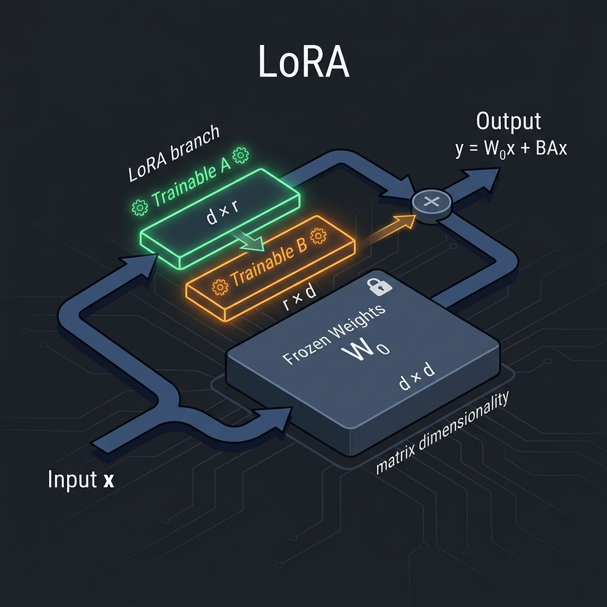

+++
date = '2026-03-20T10:00:00+05:30'
title = 'A Simple Guide to LoRA (Low-Rank Adaptation)'
description = 'Learn how Low-Rank Adaptation (LoRA) makes fine-tuning massive LLMs and generative models incredibly efficient.'
tags = ['AI', 'LoRA', 'Fine-tuning', 'Deep Learning', 'LLMs']
categories = ['Technology']
series = ['AI Guides']
math = true
+++

Have you ever tried to download or fine-tune a modern Large Language Model (LLM) like Llama 3 or Mistral? If so, you probably ran into a massive wall: **GPU memory**. Fine-tuning models with billions of parameters requires specialized, high-end hardware, costing thousands of dollars.

But what if you could achieve the exact same performance by training less than **1%** of the model's parameters? 

That is the magic of **LoRA (Low-Rank Adaptation)**. It is currently the most popular technique for making fine-tuning fast, cheap, and accessible to everyone. In this guide, we'll break down how it works, why it is so effective, and how you can use it.

---

### The Sticky Note Analogy

Imagine you bought a massive, 1,000-page encyclopedia. You want to customize it to include your family history. 

One way to do this is to rewrite the entire encyclopedia, printing all 1,000 pages again with your edits mixed in. This is **Full Fine-Tuning**. It works, but it takes a huge amount of time, paper, and effort.

Another way is to leave the encyclopedia exactly as it is, but attach a few **transparent sticky notes** to the margins of the pages where you want changes. When you read the book, you look at the original page, but you apply the edits from the sticky note on top. 

This is **LoRA**. The massive encyclopedia (the base model) remains completely frozen. The sticky notes (the low-rank adapters) are the only things you write on (train).

---

### How LoRA Works Mathematically

To understand LoRA, we need to look at how neural networks represent knowledge. 

A layer in a neural network is essentially a matrix of weights, which we can call $W_0$. When we fine-tune a model, we are trying to find a set of weight updates, which we'll call $\Delta W$ (Delta W). The final updated weights are:

$$W_{new} = W_0 + \Delta W$$

If $W_0$ is a $4096 \times 4096$ matrix, then $\Delta W$ must also be a $4096 \times 4096$ matrix, containing over 16 million parameters to train.

LoRA works on a simple, powerful hypothesis: **weight updates during adaptation have a low "intrinsic rank."** In plain English, this means we don't need to change every single connection; the important updates can be represented in a much simpler form.

Instead of training the full $\Delta W$ matrix, LoRA decomposes it into two smaller matrices, $A$ and $B$:

$$\Delta W = B \times A$$



If we choose a rank $r = 8$:
* Matrix $A$ has dimensions $r \times d$ (e.g., $8 \times 4096$)
* Matrix $B$ has dimensions $d \times r$ (e.g., $4096 \times 8$)

Now, instead of training **16.7 million** parameters in $\Delta W$, we only train:
$$(4096 \times 8) + (8 \times 4096) = 65,536\text{ parameters}$$

That is a **99.6% reduction** in trainable parameters for that layer!

---

### Why Use LoRA? The Core Benefits

LoRA has taken the AI community by storm because it solves several practical engineering problems at once:

1. **Massive Memory Savings**: By reducing the number of trainable weights, we drastically reduce the memory needed to store optimizer states (like AdamW). This allows you to fine-tune 7B or 13B parameter models on a single consumer GPU (like an RTX 3090 or 4090).
2. **Zero Inference Latency**: During inference (running the model), you can merge the adapter weights ($B \times A$) back into the base weights ($W_0$). This means the model runs at the exact same speed as the original base model—there is no extra delay.
3. **Easy Adapter Swapping**: Because the base model remains frozen, you can train multiple different adapters for different tasks (e.g., one for writing code, one for creative writing, one for translation). At runtime, you only need to keep one copy of the base model in memory and can swap out the tiny adapters (only a few megabytes each) instantly.

---

### LoRA in Practice: A Quick Code Snippet

Using LoRA is incredibly easy today, thanks to Hugging Face's `peft` (Parameter-Efficient Fine-Tuning) library. Here is a simple example of how to wrap a model with LoRA in PyTorch:

```python
from transformers import AutoModelForCausalLM
from peft import LoraConfig, get_peft_model

# 1. Load the frozen base model
model = AutoModelForCausalLM.from_pretrained("meta-llama/Meta-Llama-3-8B")

# 2. Define the LoRA configuration
lora_config = LoraConfig(
    r=8,                  # Rank: size of the low-rank matrices
    lora_alpha=32,        # Scaling factor
    target_modules=["q_proj", "v_proj"], # Target projection layers
    lora_dropout=0.05,
    bias="none",
    task_type="CAUSAL_LM"
)

# 3. Wrap the model with LoRA
peft_model = get_peft_model(model, lora_config)

# 4. Print trainable parameters
peft_model.print_trainable_parameters()
# Output: trainable params: 3,407,872 || all params: 8,033,667,072 || trainable%: 0.0424%
```

With just a few lines of code, the model is ready to be trained using only 0.04% of its total parameters!

---

### Conclusion

LoRA has democratized AI development. It shifts fine-tuning from being an expensive enterprise-only task to something any developer or hobbyist can run on a single machine. Whether you are building custom chatbots, fine-tuning Stable Diffusion styles, or experimenting with domain-specific models, LoRA is the go-to tool in the modern AI pipeline.

Have you tried fine-tuning a model using LoRA? What rank ($r$) did you find worked best for your task? Let me know in the comments!

---

*This post is part of the [AI Guides series](/series/ai-guides/). Check out the [Simple Guide to GANs](/posts/simple-guide-to-gans/) and the [Simple Guide to VAEs](/posts/simple-guide-to-vae/) for more guides on deep learning.*
